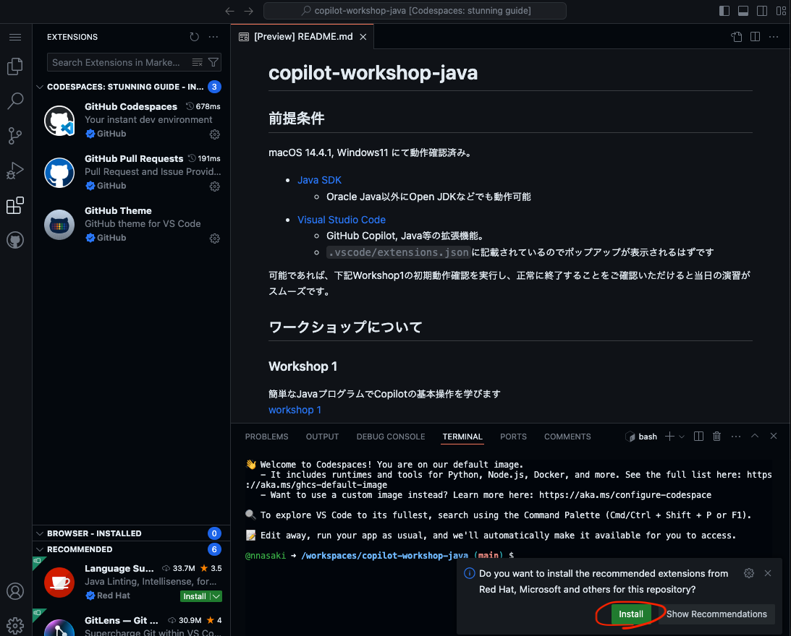

# copilot-workshop-java

## 前提条件
下記環境の準備をお願いいたします。macOS 14.4.1, Windows11 にて動作確認を行なっております。
尚、動作確認はVisual Studio Codeで行なっておりますが、GitHub CopilotをサポートしているIntelliJなどでもご参加可能です。

- [Java SDK](https://www.oracle.com/java/technologies/javase-downloads.html)
  - version:JDK 21
  - Oracle Java以外にOpen JDKなどでも動作可能
- [Maven](https://maven.apache.org/)
  - version:3.9+
  - PATHを設定し実行できるようにしてください
- [Visual Studio Code](https://code.visualstudio.com/download)
  - GitHub Copilot, Java等の拡張機能。
  - `.vscode/extensions.json`に記載されているのでポップアップが表示されるはずです
  - 
  - 以下のようにCopilotのアイコンが出ていることを確認してください
  - 

## 動作確認
下記 [workshop 1](workshop1/README.ja.md) の初期動作確認を実行し、正常に終了することをご確認いただけると当日の演習がスムーズです。

## ワークショップについて
### Workshop 1
簡単なJavaプログラムでCopilotの基本操作を学びます 
[workshop 1](workshop1/README.ja.md)

### Workshop 2
Spring BootでWebページを作りながら、CopilotとCopilot Chatを体験しましょう 
[workshop 2](workshop2/README.ja.md)

