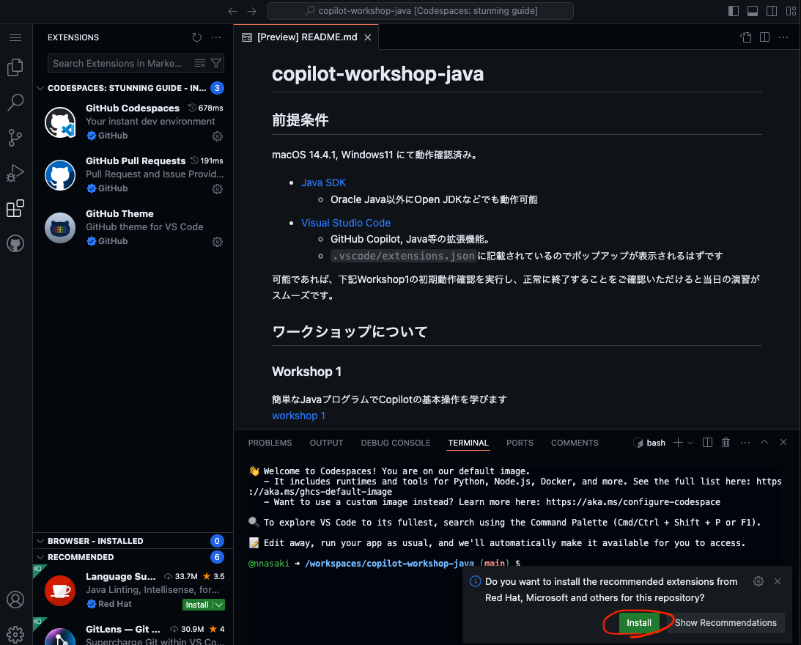
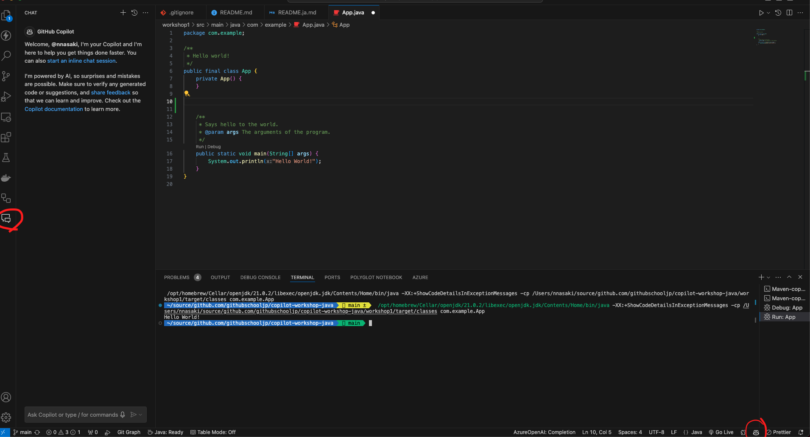

# copilot-workshop-java
日本語のREADMEは[こちら](README.ja.md)

## Prerequisites
Please prepare the following environment. We have confirmed operation on macOS 14.4.1 and Windows11. Although we have tested the operation with Visual Studio Code, you can also participate with IntelliJ, which supports GitHub Copilot.

- [Java SDK](https://www.oracle.com/java/technologies/javase-downloads.html)
  - version: JDK 21
  - It can also work with Open JDK, not just Oracle Java
- [Maven](https://maven.apache.org/)
  - version: 3.9+
  - Please set the PATH so that it can be executed
- [Visual Studio Code](https://code.visualstudio.com/download)
  - Extensions such as GitHub Copilot, Java.
  - It should be listed in `.vscode/extensions.json`, so a popup should appear
  - 
  - Please confirm that the Copilot icon is displayed as shown below
  - 

## Operation Confirmation
Please execute the initial operation confirmation of the following [workshop 1](workshop1/README.ja.md), and confirm that it ends normally. This will make the exercises on the day go smoothly.

## About the Workshop
### Workshop 1
Learn the basic operations of Copilot with a simple Java program 
[workshop 1](workshop1/README.ja.md)

### Workshop 2
Experience Copilot and Copilot Chat while creating a web page with Spring Boot 
[workshop 2](workshop2/README.ja.md)