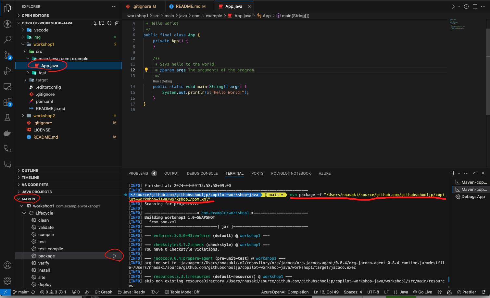
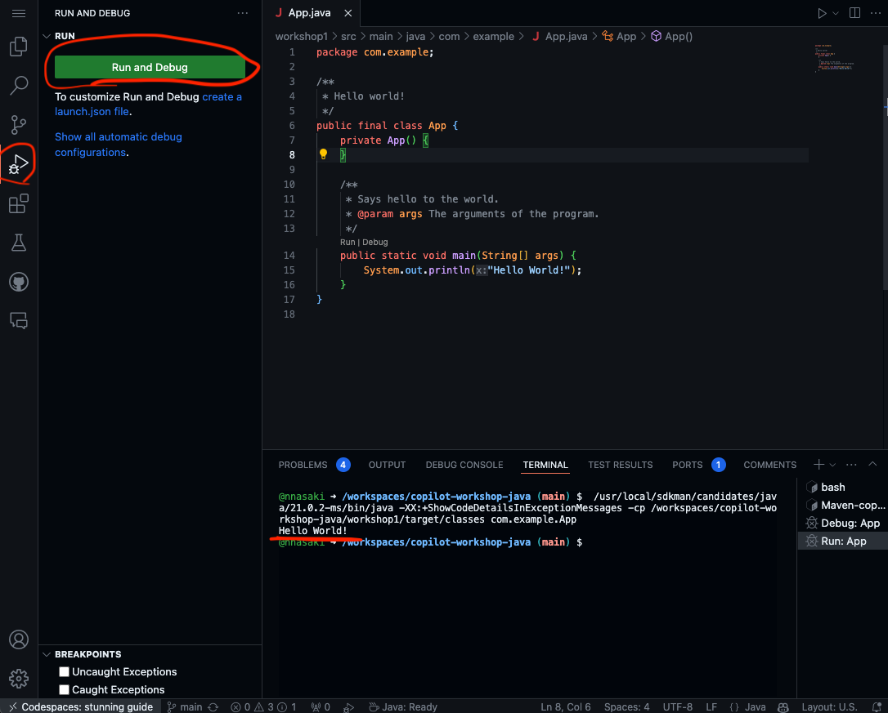

# Workshop 1 

## 初期動作確認
vscodeにて`mvn package`を実行します。ターミナルからでも良いですし、以下のようにGUIから操作することも可能です。

正常終了することを確認し、次の画面で実行を行い、`Hello, World!`が出力されることをご確認ください

以上で初期動作確認は完了です。

## ハンズオン：指定した数字を逆順にする関数を実装しよう
本演習ではGitHub Copilotを利用してコーディングすることを学びます。

### 関数を追加
### テストを追加
