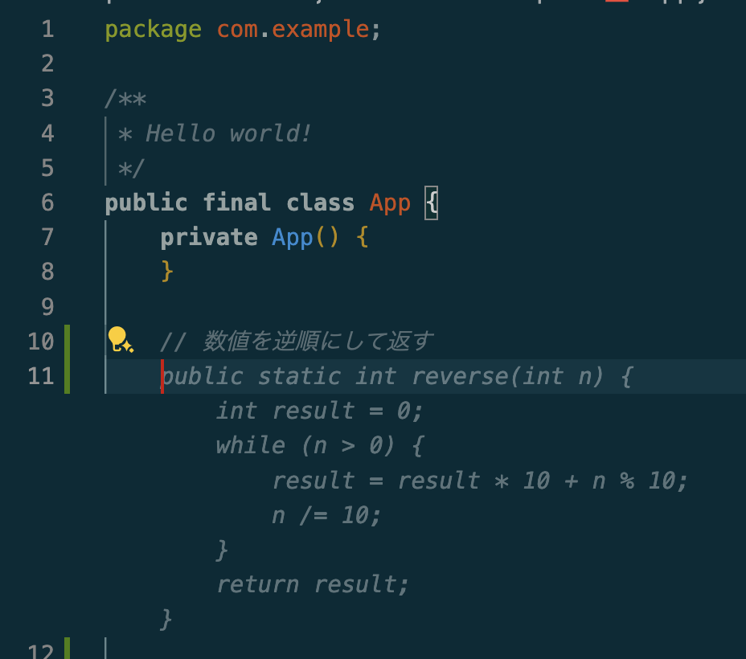
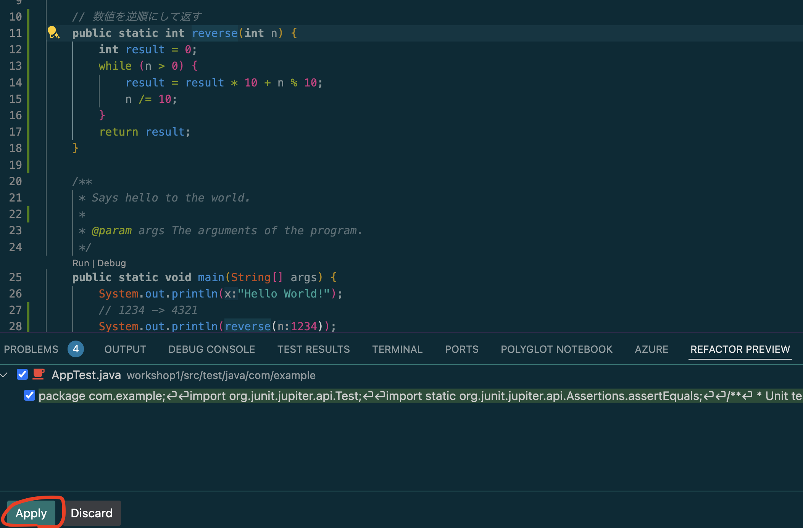

# Workshop 1 

## 初期動作確認
vscodeにて`mvn package`を実行します。ターミナルからでも良いですし、以下のようにGUIから操作することも可能です。


正常終了することを確認し、次の画面で実行を行い、`Hello, World!`が出力されることをご確認ください


以上で初期動作確認は完了です。

## ハンズオン：指定した数字を逆順にする関数を実装しよう
本演習ではGitHub Copilotを利用してコーディングすることを学びます。

### 関数を追加
単純に与えられた数値を逆順に表示する関数を追加します。以下のようなイメージです。


`App.java`に`数値を逆順にして返す`のようなコメントを入れて、キーボードの`return`を入力すると、GitHub Copilotがコードを提案してくれます。


> [!NOTE]
> コードが提案されない場合、GitHub Copilotが有効化されているかご確認ください。
> IDEを再起動などをお試しください。

キーボードの`tab`を入力するとコードが確定されます。

### main関数から呼び出す
main関数の中に`// 1234`のように入れると以下のようなサジェストが出ます


> [!NOTE]
> LLMの特性上、必ず同じ結果にはなりません。皆様の環境で動作が異なる場合がございます。

`return`を入力すると確定し、また再度`tab`を入力するとコードが生成されますので`return`で確定します


実行し、以下のように期待する動作になるか確認しましょう。
```
Hello World!
4321
```

同様の操作を行うと値を追加できます。

### テストを追加
追加した関数をクリックして、左のマークをクリック


`Test using Copilot: reverse` をクリックし、画面下部の`Apply`をクリック


`AppTest.java`ファイルを開き、元のコードを削除する


下図の２つある赤丸のどちらかをクリックすることでテストが実行できます。エラーが起きないことを確認


テストも同様に追加して確認しましょう

### 仕様変更に対応しよう
今回はただ与えられた数字を逆順にして返すという単純なプログラムですが、次のケースの場合はどのように振る舞えば良いでしょうか？
1. 0
2. -(マイナス)
3. Integerの正の最大値、または、負の最大値
   1. Integerの範囲で表現できるか？
   2. オーバーフローは起きないか？
4. 1000のような0が連続した数値
   1. 0001が正しいのでしょうか？1のみで良いのでしょうか？

簡単なプログラム、関数に見えますが様々な入力値が存在し、考慮すべき点が多いことに気づかれましたか？
この問題に対応するため、チームで話し合った結果、もしくは偉い人の鶴の一声で、今まで数値で返却していた値を文字列として返却することに仕様変更されました。

これまでにプロダクトコードの他にテストコードも追加されました。皆さんは急な仕様変更に対しても自信を持って作業する準備はできているはずです。（そうですよね？）
このような変更はCopilotではなくCopilot Chatに依頼するとスムーズです。

```
この関数を以下の条件に対応できるように文字列で返却するように変更してください。
1. パラメーター：0　結果：0
2. パラメーター：-1　結果：-1
3. パラメーター：-1234　結果：-4321
4. パラメーター：Integer.MAX_VALUE(2147483647)　結果：7463847412
5. パラメーター：Integer.MIN_VALUE(-2147483648)　結果：-8463847412
6. パラメーター：1000 結果：0001
```

Copilot Chatは一回で全ての問題を解決できないこともあります。その場合は何度か起こった問題に対して解決を試みてください。
