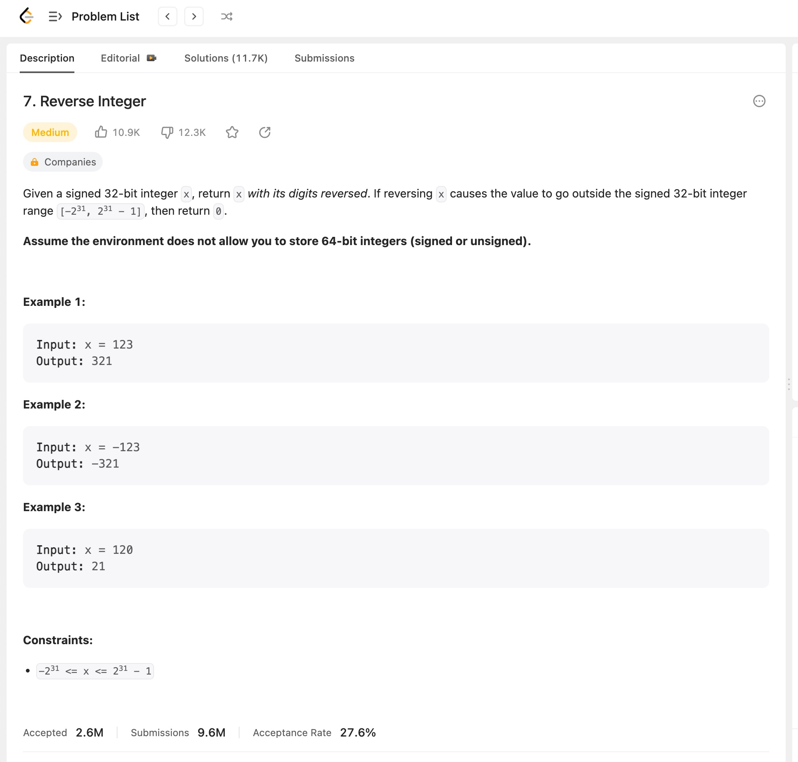
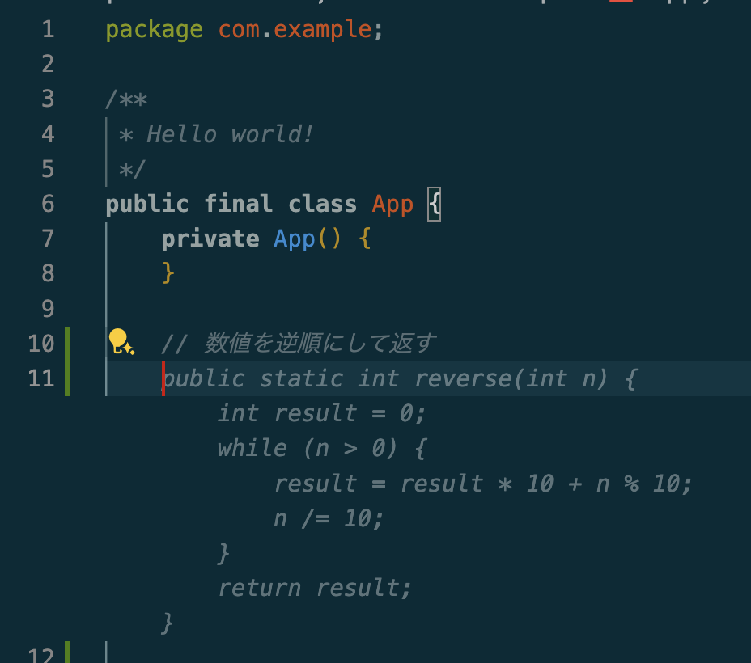
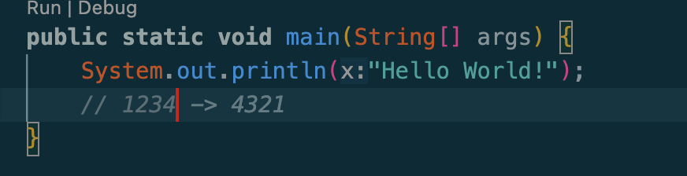
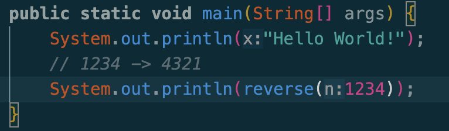
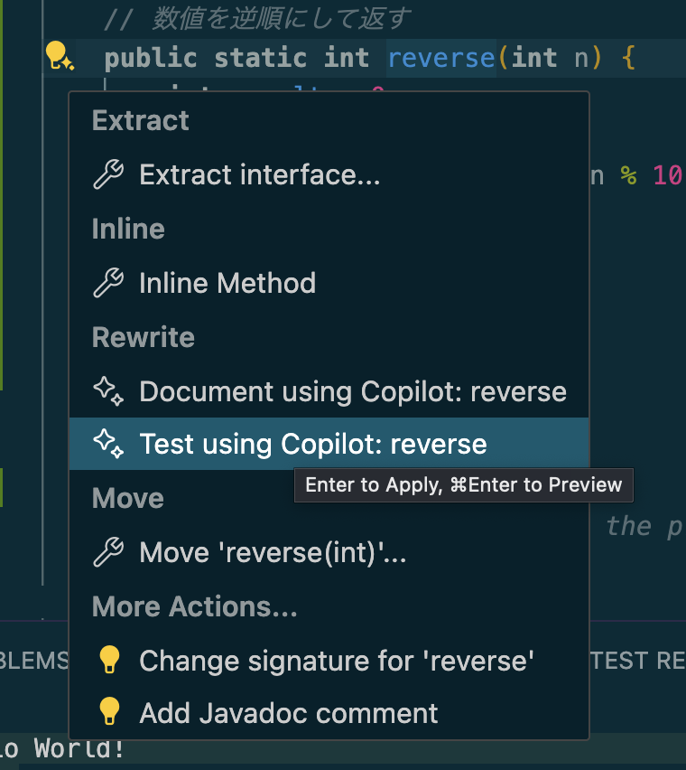
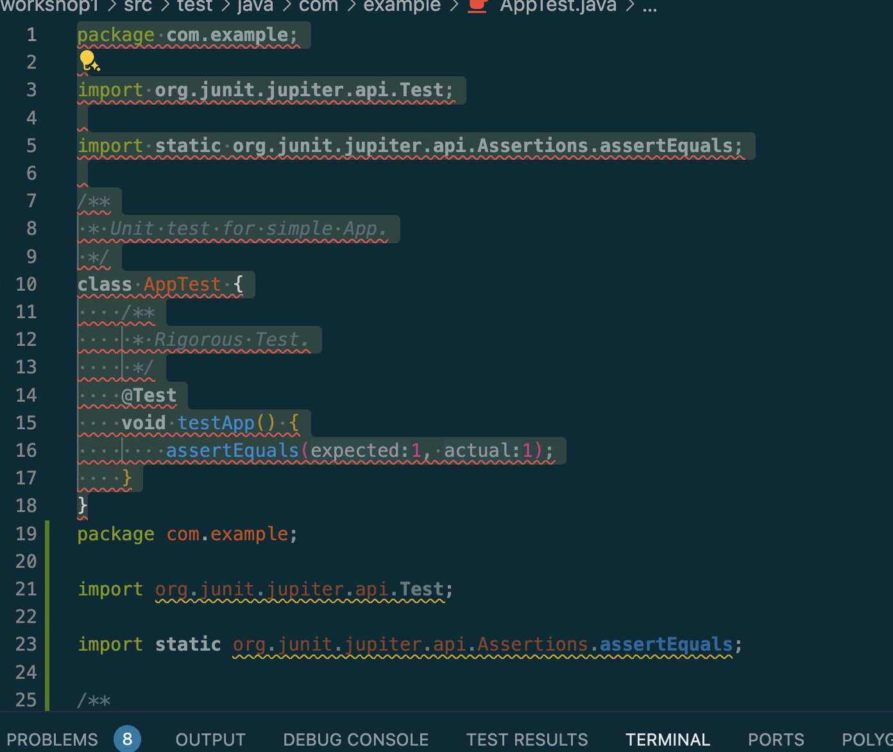
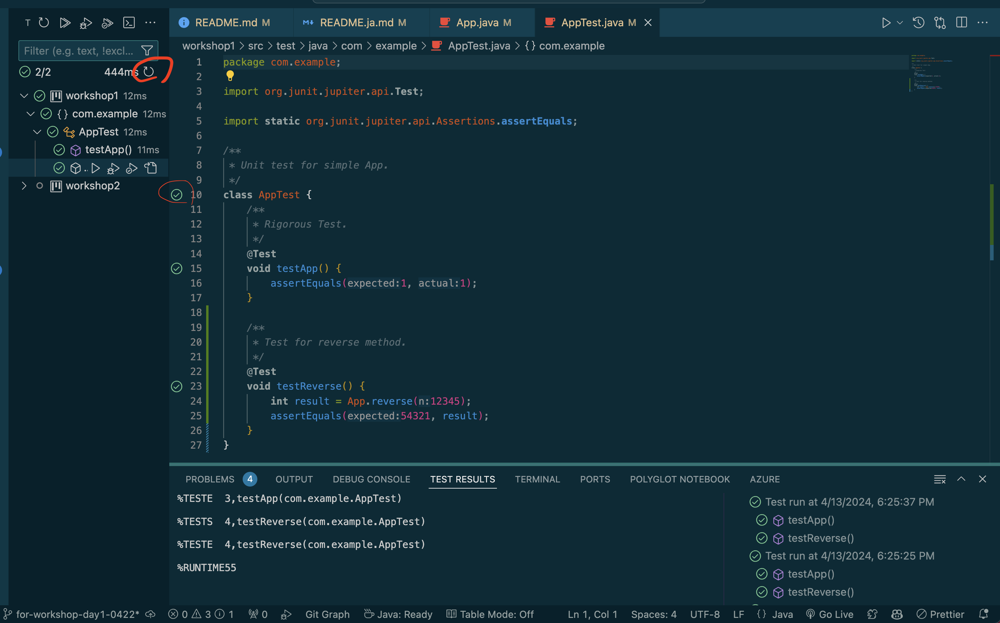

# Workshop 1 
日本語のREADMEは[こちら](README.ja.md)

## Initial Operation Confirmation
Execute `mvn package` in vscode. You can do this from the terminal or from the GUI as shown below.


Confirm that it finishes normally, then execute the next screen and confirm that `Hello, World!` is output.


With this, the initial operation confirmation is complete.

## Hands-on: Implement a function to reverse a specified number
In this exercise, you will learn to code using GitHub Copilot.

### Add a function
Simply add a function to display the given number in reverse order. Here is an image of what it looks like.


When you enter a comment like `reverse the number` in `App.java` and press the `return` key on your keyboard, GitHub Copilot will suggest code for you.


> [!NOTE]
> If no code is suggested, please check if GitHub Copilot is enabled.
> Try restarting your IDE.

When you press the `tab` key on your keyboard, the code is confirmed.

### Call from the main function
If you enter something like `// 1234` in the main function, you will get a suggestion like the one below.


> [!NOTE]
> Due to the nature of LLM, the results will not always be the same. There may be differences in operation depending on your environment.

When you press `return`, it is confirmed, and when you press `tab` again, the code is generated, so confirm with `return`.


Execute it and check if it behaves as expected.

```
Hello World!
4321
```

You can add values by performing the same operation.

### Add a test
Click on the added function and click on the mark on the left.


Click on `Test using Copilot: reverse` and click on `Apply` at the bottom of the screen.


Open the `AppTest.java` file and delete the original code.

You can run the test by clicking on either of the two red circles shown below. Check that no errors occur.


Let's also add and check the test in the same way.

### Respond to specification changes
This time, it's a simple program that just reverses the given number and returns it, but what should we do in the following cases?
1. 0
2. Negative
3. The maximum positive or negative value of Integer
   1. Can it be expressed within the range of Integer?
   2. Will there be an overflow?
4. Numbers with consecutive zeros like 1000
   1. Is 0001 correct? Or should it be just 1?
Did you realize that even a simple program or function has various input values and many points to consider?
To address this issue, after discussing with the team or at the whim of a higher-up, the specification was changed to return the value as a string, which had been returned as a number.

In addition to the product code, test code has also been added. You should be ready to work with confidence even in the face of sudden specification changes. (Right?)
Such changes are smoother to request in Copilot Chat rather than Copilot.

```
Please modify this function to return as a string that can handle the following conditions.
1. パラメーター：0　結果：0
2. パラメーター：-1　結果：-1
3. パラメーター：-1234　結果：-4321
4. パラメーター：Integer.MAX_VALUE(2147483647)　結果：7463847412
5. パラメーター：Integer.MIN_VALUE(-2147483648)　結果：-8463847412
6. パラメーター：1000 結果：0001
```

Copilot Chat may not be able to solve all problems at once. If that's the case, try to solve the problem that occurred several times.